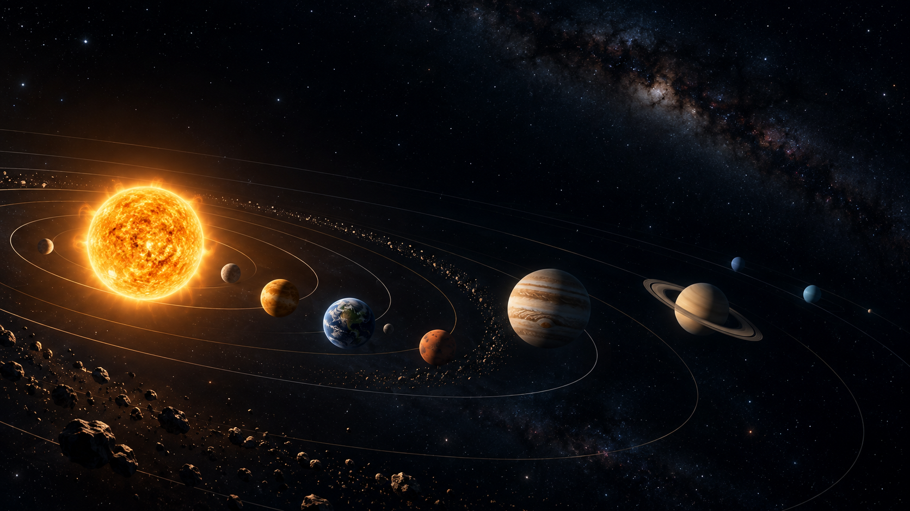
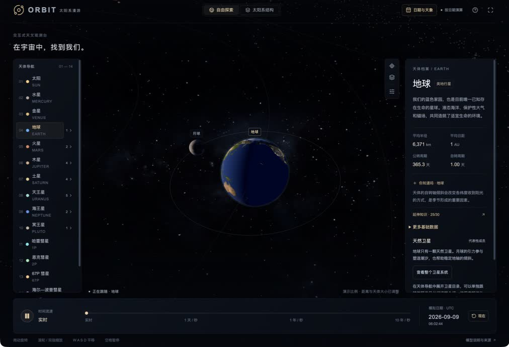
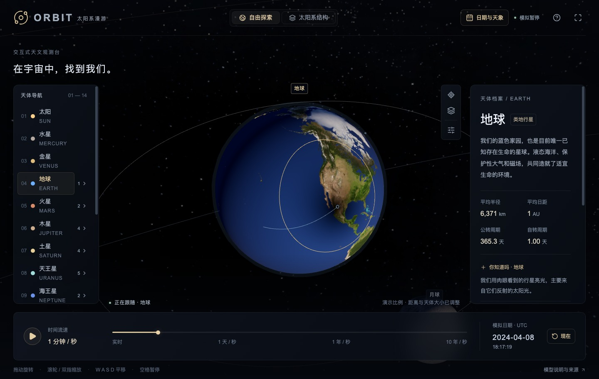
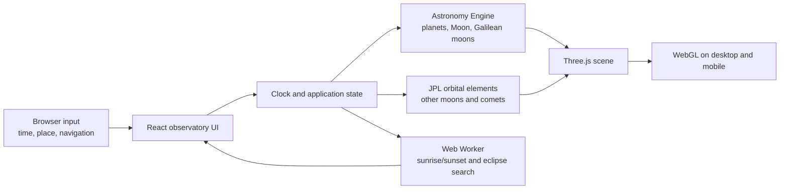

<div align="center">
  

# ORBIT · Solar System Observatory

**An interactive 3D Solar System observatory for learning**

**[English](README.md) · [简体中文](README.zh-CN.md)**

[Live demo](https://orbit-henna-xi.vercel.app/) · [Report an issue](https://github.com/hugogu/orbit/issues) · [Request a feature](https://github.com/hugogu/orbit/issues/new)

</div>

> The banner is project artwork, not an application screenshot. ORBIT runs entirely in the browser.

ORBIT combines an explorable 3D scene, a controllable simulation clock, and astronomy calculations with stated sources and assumptions. Follow a body through the Solar System, inspect selected moons and famous comets, and use an observer location to explore sunrise, sunset, and eclipses.

## Highlights

|     | Explore                                                                                                  | Learn                                                         |
| --- | -------------------------------------------------------------------------------------------------------- | ------------------------------------------------------------- |
| ☀️  | Run the scene at the present moment or at any UTC time from **1700–2200**                                | Planetary positions, orbital motion, rotation, and timescales |
| 🪐  | Browse the Sun, eight planets, Pluto, 19 representative moons, four famous comets, and Saturn’s rings    | Object types, orbits, and physical properties                 |
| 🔭  | Select, follow, or view a body from above; expand a planet in the navigator to open a moon directly      | Move from the full system to a single world                   |
| 🌅  | Enter a location and fixed UTC offset, or request browser geolocation                                    | A local day’s sunrise, sunset, and daylight length            |
| 🌑  | Find the next solar eclipse, lunar eclipse, and locally visible solar eclipse                            | Event timing and eclipse geometry                             |
| 🌗  | See terminators, Earth’s city lights at night, and solar-eclipse umbra, penumbra, and shadow-axis tracks | Illumination and eclipse geometry                             |
| ✨  | Choose automatic, standard 2K, or ultra textures up to 8K; the Milky Way can be toggled separately       | A practical balance between detail and device performance     |
| 🗺️  | Optionally load 2K real-surface relief and high-density terrain geometry for Mercury, Venus, Earth, and Mars only when focused | Published topography can change close-up lighting and silhouette; the geometry mode is opt-in |
| 📱  | Navigate with mouse, keyboard, touch gestures, and responsive portrait or landscape layouts              | Continuous exploration across desktop and mobile              |
| 🌐  | Switch between Simplified Chinese, English, and Japanese; your language choice is remembered            | Translated profiles, fact cards, scene labels, and astronomy tools |

## See it running

<table>
  <tr>
    <td width="50%" align="center"><br /><sub>Earth’s city lights emerge naturally on the night-facing hemisphere.</sub></td>
    <td width="50%" align="center"><br /><sub>The 8 April 2024 total solar eclipse: surface shadow boundaries and the shadow-axis path.</sub></td>
  </tr>
</table>

Both images above were captured from a running ORBIT observatory. Texture selection considers the user setting, device class, data-saving preference, and GPU texture limits. High-resolution maps are loaded for the focused body only when needed, then the previous map is released.

The base scene uses a high-quality sphere mesh with each planet's measured oblate flattening; color maps add imagery or clouds. **Observation settings → Textures → Real terrain lighting** optionally loads body-specific 2K normal maps derived from published topography for Mercury, Venus, Earth, and Mars. **Real terrain geometry** is a separate opt-in switch: it loads a 2K grayscale global elevation map for the focused terrestrial planet and displaces a 256×128 mesh, with a clearly noted 6× visual exaggeration so relief is visible at the observatory scale. Jupiter, Saturn, Uranus, and Neptune have no solid surface, so their atmospheric maps stay unchanged.

## Controls

The navigator has separate collapsible **Asteroids** and **Comets** groups. Nine named small bodies—Ceres (a dwarf planet), Pallas, Juno, Vesta, Psyche, Eros, Itokawa, Bennu, and Ryugu—can be selected in the scene or opened from their localized profiles. Each has an independently sourced surface or measured-albedo material, an orbital path, physical data, and attributed share images. Eight use mission or observing shape models; Ceres keeps an observed near-spherical body with its Dawn map and topography normal. Only the selected asteroid's label and orbit are shown, to keep the overview readable.

Asteroid elements and physical values are an offline [NASA/JPL SBDB](https://ssd.jpl.nasa.gov/tools/sbdb_lookup.html) snapshot retrieved on 2026-09-13. Epoch-aware two-body motion omits perturbations and thermal effects; it is not suitable for close-approach or impact prediction. Size and distance settings also apply to asteroids. The scene imports body-specific [PDS, Dawn, Hayabusa/Hayabusa2, OSIRIS-REx, VLT/SPHERE, and DAMIT shape data](public/models/asteroids/CREDITS.md), plus separate observed surface maps where available; Pallas uses Carry et al.'s published partial K-band relative-albedo map sampled onto its matching DAMIT model, and Psyche uses the relative facet-albedo data paired with DAMIT model 1806. Juno has no downloadable global albedo map, so it keeps its own measured albedo and spectral material instead of borrowing a shared texture. See [asteroid surface credits](public/textures/asteroids/CREDITS.md). Asteroids do not participate in eclipse calculations.

| Scene navigation                                                                                           | Time control                                                                              | Astronomy tools                                                     |
| ---------------------------------------------------------------------------------------------------------- | ----------------------------------------------------------------------------------------- | ------------------------------------------------------------------- |
| Left-drag to orbit, wheel to zoom, right-drag to pan                                                       | Nine rates, pause, return to now, and seek to a date                                      | Sunrise/sunset, global eclipses, and locally visible solar eclipses |
| One finger to orbit, pinch to zoom, two fingers to pan                                                     | Selection changes do not reset the simulation clock                                       | Focus Earth or Moon at eclipse maximum                              |
| `WASD` / arrow keys to pan, `+` / `-` to zoom, `Space` to pause, `R` for overview, `Esc` to stop following | From real time to ten years per second, including one minute per second for eclipse study | Manual coordinates or browser geolocation                           |

Solar activity can be toggled in display settings. Prominences, coronal filaments, and sunspots share the UTC simulation clock: pause freezes them, and revisiting a date reproduces the same model state. Try **1 day/second** to see growth, decay, and rotation. Lifetimes use illustrative day-to-month ranges and latitude-dependent rotation; generated regions are not historical observations or predictions. See [NASA prominences](https://www.nasa.gov/image-article/what-solar-prominence/), [NASA sunspots](https://science.nasa.gov/sun/sunspots/), and [NASA differential rotation](https://www.nasa.gov/image-article/solar-rotation-varies-by-latitude/).

## Scene and data flow



### Objects in the observatory

- **Planetary system:** the Sun, eight planets, Pluto, Saturn’s rings, the asteroid belt, Kuiper belt, scattered disc, heliosphere, and a schematic Oort cloud.
- **Moon directory:** 19 individually selectable representative moons, including the Moon, the Galilean moons, and Charon. Each has its own article, physical data, orbital data, sources, and a rotating fact card.
- **Comet navigation:** Halley, Encke, 67P/Churyumov–Gerasimenko, and Hale–Bopp. Observe their model trajectories on the shared time axis or jump to the next model perihelion.
- **Knowledge cards:** each of the 33 selectable bodies has 30 sourced “Did you know?” entries. The opening selection rotates between visits.

## Quick start

### Prerequisites

- [Node.js](https://nodejs.org/) `>= 22.13.0`
- npm; this repository includes `package-lock.json`
- A modern WebGL-capable browser with hardware acceleration recommended

### Run locally

```bash
git clone git@github.com:hugogu/orbit.git
cd orbit
npm ci
npm run dev
```

Open the local URL printed by the development server. Browser geolocation is requested only in a secure context: HTTPS or localhost.

### Verify a change

```bash
npm test
npm run lint
npx tsc --noEmit
npm run build
```

The test suite covers the UTC clock, coordinate transforms, Earth day/night orientation, satellite and comet orbits, eclipse maxima, location boundaries, texture policy, and interaction state. Run the Vercel export as well before a Vercel release:

```bash
npm run build:vercel
```

## Deployment

ORBIT deploys as a static export to Vercel, with a separate Cloudflare Worker build for the Sites platform, and optional Google Analytics configured through one environment variable. See the [deployment guide](docs/deployment.md) for Vercel project setup, build settings, and analytics configuration.

The Vercel build also emits crawlable body profiles under `/:locale/bodies/:id`, plus `robots.txt` and `sitemap.xml`. Set `NEXT_PUBLIC_SITE_URL` to the permanent HTTPS hostname in the Vercel project before deploying; the build uses it for canonical, Open Graph, alternate-language, and sitemap URLs. The demo hostname is used when the variable is absent.

## Accuracy and model boundaries

ORBIT is an educational tool with explicit assumptions, not a navigation product or professional ephemeris service. Display and event search use the same UTC clock, but each part has a different accuracy envelope:

| Scope                                    | Approach                                                                                                                   | What to keep in mind                                                                                          |
| ---------------------------------------- | -------------------------------------------------------------------------------------------------------------------------- | ------------------------------------------------------------------------------------------------------------- |
| Planets, Pluto, Moon, and Galilean moons | [Astronomy Engine](https://github.com/cosinekitty/astronomy) positions transformed into a fixed J2000 ecliptic scene frame | Intended for educational viewing; surface-map longitude alignment is not a cartographic guarantee             |
| Other representative moons               | Fixed-epoch JPL mean orbital elements                                                                                      | Perturbations, resonances, and long-term precession are omitted; phase error can grow away from the epoch     |
| Four comets                              | Two-body propagation of JPL Small-Body Database snapshots                                                                  | Gravitational perturbations and outgassing are omitted; return and perihelion dates are not precise forecasts |
| Sunrise, sunset, and eclipses            | Independent Web Worker search; sunrise/sunset use a supplied fixed UTC offset, solar upper limb, and standard refraction   | No terrain, weather, or dynamic daylight-saving rules; a global eclipse is not necessarily locally visible    |
| Eclipse shadows                          | Physical radii and heliocentric vectors produce umbra, penumbra, and antumbra before mapping to the display meshes         | No atmospheric refraction, limb darkening, terrain, rings, or comet effects                                   |

### Scale options

The default demonstrative view compresses distances and enlarges bodies so the system remains readable in one scene. **Observation settings → Layout** keeps the true-size and true-distance switches together. Changes apply immediately and are saved in this browser. With both true-scale options enabled, the Sun, planets, and 19 moons share one physical scale; comet nuclei, tails, and glows remain instructional illustrations. Display adjustments do not affect the simulation date, orbital periods, or sky event calculations.

## Technology

| Area                    | Stack                                                                      |
| ----------------------- | -------------------------------------------------------------------------- |
| Interface               | React 19, TypeScript, Vinext                                               |
| 3D rendering            | Three.js, WebGL                                                            |
| Ephemeris and events    | Astronomy Engine, JPL data, browser Web Worker                             |
| Styling and interaction | Tailwind CSS, Base UI, Lucide                                              |
| Analytics               | Google Analytics 4 via `next/script`, optional and env-gated               |
| Delivery                | Vercel static export, with a separate Sites/Cloudflare Worker build target |

## Contributing

To improve a translation or add another language, see the [localization guide](docs/i18n.md). Languages are registered in one place with separate catalogs; switching preserves the selected body, camera, and simulation clock.

Contributions are welcome. Start by reviewing the existing [issues](https://github.com/hugogu/orbit/issues) to avoid duplicate work.

1. Fork the repository and create a focused branch from the default branch.
2. Keep a change small and complete. Separate feature work, refactors, and build configuration where practical.
3. Add or update tests for changed behavior, then run every command under “Verify a change”.
4. In a pull request, explain the visible behavior, any changed source or modelling assumption, and how you verified it.

For a bug report, include the browser and version, device class, viewport size, time of occurrence, relevant time zone or coordinates, and reproducible steps. Do not include keys, a precise home address, or other sensitive data.

## Data and asset credits

- [NASA Solar System](https://science.nasa.gov/solar-system/planets/), [NASA Kuiper Belt](https://science.nasa.gov/solar-system/kuiper-belt/facts/), and [NASA Oort Cloud](https://science.nasa.gov/solar-system/oort-cloud/facts/)
- [JPL planetary physical parameters](https://ssd.jpl.nasa.gov/planets/phys_par.html), [JPL approximate positions and Keplerian elements](https://ssd.jpl.nasa.gov/planets/approx_pos.html), and [JPL satellite data](https://ssd.jpl.nasa.gov/sats/)
- [JPL Small-Body Database](https://ssd.jpl.nasa.gov/tools/sbdb_lookup.html)
- [NASA eclipse geometry](https://eclipse.gsfc.nasa.gov/SEhelp/SEgeometry.html)
- [Astronomy Engine](https://github.com/cosinekitty/astronomy) (MIT)
- Most planetary textures come from [Solar System Scope Textures](https://www.solarsystemscope.com/textures/), used under [CC BY 4.0](https://creativecommons.org/licenses/by/4.0/). File dimensions, download sources, and license information are recorded in [`public/textures/source-manifest.json`](public/textures/source-manifest.json). Some maps use enhanced colour or illustrative terrain; the Milky Way panorama is an immersive background, not a live sky chart for the observer’s location.
- Optional planetary surface relief maps and height maps are derived from published NASA/USGS/NOAA elevation data; see [`public/textures/planets/CREDITS.md`](public/textures/planets/CREDITS.md). Normal maps affect lighting only. The separate terrain-geometry switch uses the local 2K height maps for Mercury, Venus, Earth, and Mars to displace only the focused planet's dense mesh, with a documented 6× visual exaggeration. Gas giants have no solid surface and keep their atmospheric rendering.
- Satellite maps are redistributed from [CelestiaContent](https://github.com/CelestiaProject/CelestiaContent) under the individual CC BY or CC BY-SA terms recorded in [`public/textures/satellites/CREDITS.md`](public/textures/satellites/CREDITS.md). The Voyager-derived maps for Ariel, Miranda, Umbriel, Titania, Oberon, and Triton contain unmapped regions; the local copies fill those gaps by mirroring nearby observed texture so a close-up globe does not show a flat half. Nereid, Pluto, Charon, and comet nuclei use the CC BY 4.0 `asteroid.jpg` surface as explicitly illustrative teaching textures because complete global albedo maps are not available.
- Asteroid maps and converted shape assets come from the sources listed in [`public/textures/asteroids/CREDITS.md`](public/textures/asteroids/CREDITS.md) and [`public/models/asteroids/CREDITS.md`](public/models/asteroids/CREDITS.md). The generic `asteroid.jpg` fallback is no longer used by the named asteroid catalog.
- Uranus uses Solar System Scope's CC BY 4.0 atmospheric rendering. The former non-commercial Uranus and Charon files, and the former NASA/JPL Pluto teaching map with unclear redistribution terms, are not used or redistributed.

## License

The source code in this repository is available under the [PolyForm Noncommercial License 1.0.0](LICENSE). It permits personal, educational, research, hobby, and other noncommercial use, including local deployment and noncommercial modifications, subject to the license terms. It does not grant commercial hosting, SaaS, paid distribution, or commercial product rights.

Commercial use requires a separate written agreement; see [Commercial licensing](COMMERCIAL-LICENSE.md). The project name, logo, and official distribution rules are described in [Trademark and official distribution policy](TRADEMARKS.md).

Third-party code, data, and textures keep their own licenses. See the [satellite texture credits](public/textures/satellites/CREDITS.md) and the [texture source manifest](public/textures/source-manifest.json) for asset-specific terms.
