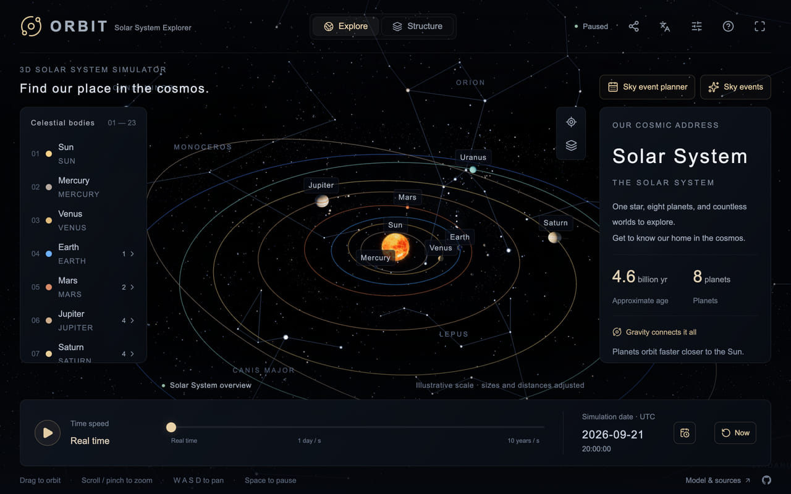
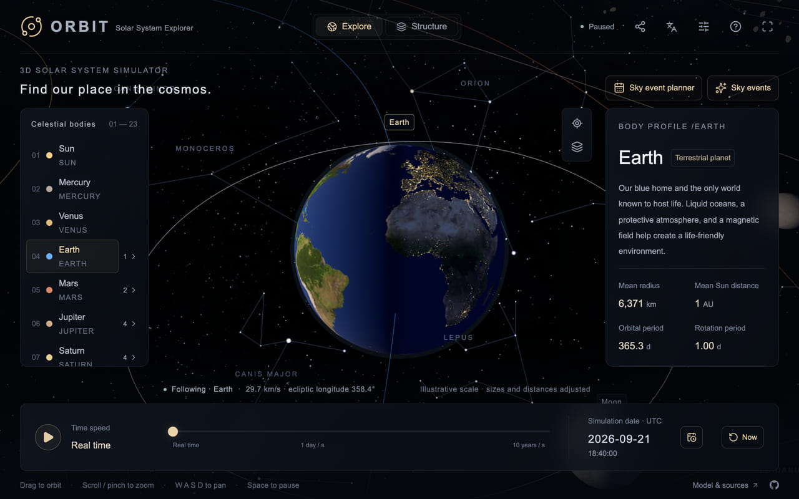
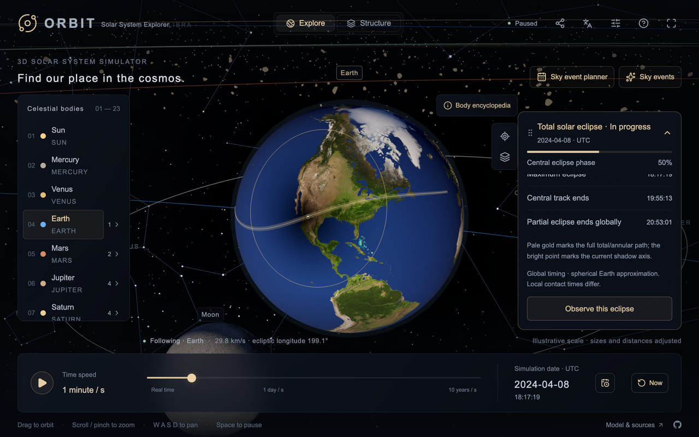
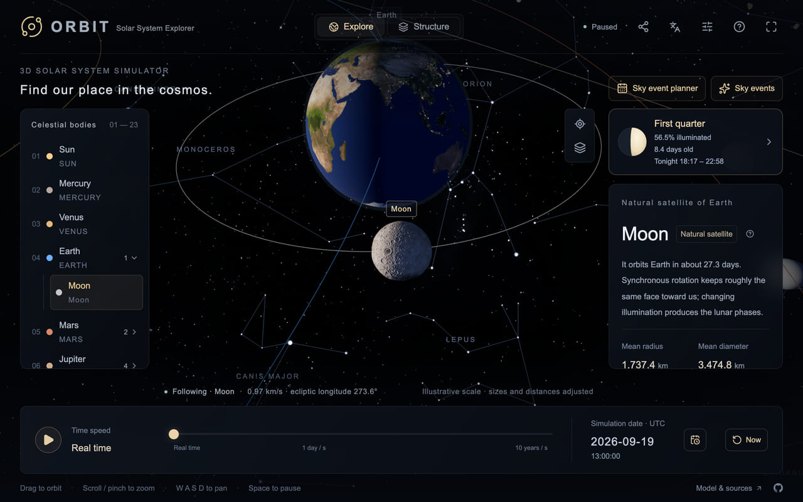
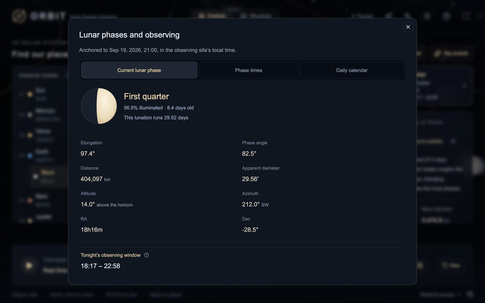
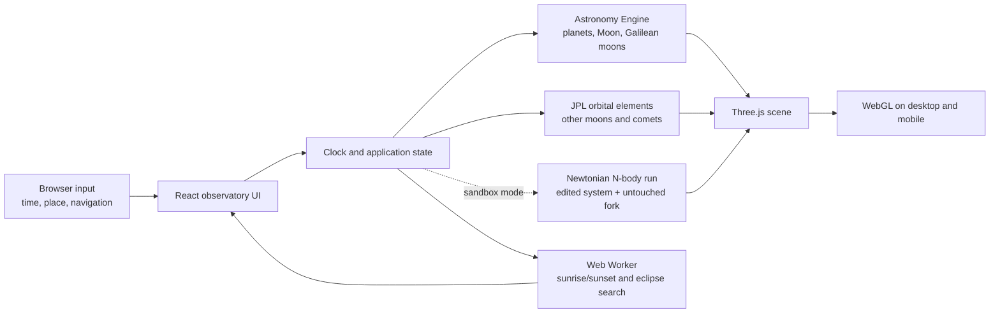

<div align="center">
  

# ORBIT · Solar System Observatory

**An interactive 3D Solar System observatory for learning**

**[English](README.md) · [简体中文](README.zh-CN.md)**

[Live demo](https://orbits.observer/) · [Report an issue](https://github.com/hugogu/orbit/issues) · [Request a feature](https://github.com/hugogu/orbit/issues/new)

</div>

> The banner is project artwork, not an application screenshot. ORBIT runs entirely in the browser.

ORBIT combines an explorable 3D scene, a controllable simulation clock, and astronomy calculations with stated sources and assumptions. Follow a body through the Solar System, inspect selected moons and famous comets, and use an observer location to explore sunrise, sunset, and eclipses.

## Highlights

|     | Explore                                                                                                                                  | Learn                                                                                         |
| --- | ---------------------------------------------------------------------------------------------------------------------------------------- | --------------------------------------------------------------------------------------------- |
| ☀️  | Run the scene at the present moment or at any UTC time from **1700–2200**                                                                | Planetary positions, orbital motion, rotation, and timescales                                 |
| 🪐  | Browse the Sun, eight planets, Pluto, 19 representative moons, four famous comets, and Saturn’s rings                                    | Object types, orbits, and physical properties                                                 |
| 🔭  | Select, follow, or view a body from above; expand a planet in the navigator to open a moon directly                                      | Move from the full system to a single world                                                   |
| 🌅  | Enter a location and fixed UTC offset, or request browser geolocation                                                                    | A local day’s sunrise, sunset, and daylight length                                            |
| 🌑  | Find the next solar eclipse, lunar eclipse, and locally visible solar eclipse                                                            | Event timing and eclipse geometry                                                             |
| 🌒  | Select the Moon for a phase card that opens the next twelve principal phase times, a month of daily readings, and tonight’s observing window | Moon age, illumination, distance, apparent diameter, rise, transit, set, and when to look     |
| 🌗  | See terminators, Earth’s city lights at night, and solar-eclipse umbra, penumbra, and shadow-axis tracks                                 | Illumination and eclipse geometry                                                             |
| 🧪  | Enter Sandbox mode to fork the current instant into a Newtonian N-body run: edit any body’s mass, orbital speed or distance, add or remove bodies, and watch the new path against the original one at the same instant | What actually holds a solar system together, and what it takes to break it                    |
| ✨  | Choose automatic, standard 2K, or ultra textures up to 8K; the Milky Way can be toggled separately                                       | A practical balance between detail and device performance                                     |
| 🌌  | Turn on a real star field: 9,096 catalogued naked-eye stars carried to the simulated year by their own proper motion, the 88 IAU constellation figures, and a Milky Way panorama aligned to the same sky | The background behind the planets is the sky those planets are really seen against            |
| 🗺️  | Optionally load 2K real-surface relief and high-density terrain geometry for Mercury, Venus, Earth, Mars, and the Moon only when focused | Published topography can change close-up lighting and silhouette; the geometry mode is opt-in |
| 📱  | Navigate with mouse, keyboard, touch gestures, and responsive portrait or landscape layouts                                              | Continuous exploration across desktop and mobile                                              |
| 🌐  | Switch between Simplified Chinese, English, and Japanese; your language choice is remembered                                             | Translated profiles, fact cards, scene labels, and astronomy tools                            |
| 📚  | Read the sky-event guide: meteor showers, conjunctions, oppositions, elongations, lunar phases, and eclipses                              | What causes each recurring event, how often it returns, and how to watch it                    |
| 🔗  | Share the view on screen: the link reopens the same moment, body, and framing, and carries the captured frame with it                    | Showing someone else exactly what you are looking at                                          |

## See it running

<table>
  <tr>
    <td width="50%" align="center"><br /><sub>The opening overview: planets on their orbits, against the constellations they are really seen among.</sub></td>
    <td width="50%" align="center"><br /><sub>Earth’s city lights emerge naturally on the night-facing hemisphere.</sub></td>
  </tr>
  <tr>
    <td width="50%" align="center"><br /><sub>The 8 April 2024 total solar eclipse: shadow boundaries, the shadow-axis path, and the live progress card.</sub></td>
    <td width="50%" align="center"><br /><sub>Selecting the Moon raises a phase card beside its profile, with tonight’s observing window.</sub></td>
  </tr>
</table>

All four images above were captured from a running ORBIT observatory. Texture selection considers the user setting, device class, data-saving preference, and GPU texture limits. High-resolution maps are loaded for the focused body only when needed, then the previous map is released.

The base scene preserves each planet's volumetric mean radius while applying observed flattening. **Observation settings → Textures → Real terrain lighting** and **Real terrain geometry** are independent options for Mercury, Venus, Earth, Mars, and the Moon. The settings use georeferenced public elevation data with 6× vertical exaggeration: lighting adds 2K object-space normals; geometry rebuilds the focused body's 256×128 mesh, including normals, bounds, and picking. Earth retains sea-level oceans. Venus switches to a cloud-free terrain view with an illustrative base color. Neither option computes terrain self-shadows. Giants keep their atmospheric appearances. See [data and regeneration](public/textures/planets/CREDITS.md).

Comets now use body-specific nucleus meshes. Halley uses the Phil Stooke/NASA PDS model and 67P uses ESA/Rosetta's low-resolution Cartesian triplate model; both are loaded only when selected and remain cached after loading. Encke and Hale–Bopp have no public complete global nucleus model in this bundle, so their meshes are explicit observation-constrained approximations. Comet albedo, coma, and tails remain illustrative. See [comet model credits](public/models/comets/CREDITS.md).

### The sky behind the planets

The background is no longer decoration. It carries 9,096 naked-eye stars from the Yale Bright Star Catalogue, placed by their J2000 equatorial coordinates, sized and tinted by the published magnitude and B−V colour index, and carried to the simulated year by their own proper motion — so winding the clock forward moves the nearby fast movers, not just the planets. Over them sit the traditional lines of the 88 IAU constellations, with every published vertex snapped to the nearest catalogued star, so a figure never ends on empty sky. Each name is written among the stars it names rather than at a chart's printed label point: four tenths of the way down the figure's own height, centred across its width, and in the reader's own language. The Milky Way panorama is turned through galactic coordinates into the same J2000 frame, so its band agrees with the stars drawn in front of it. The whole field stays centred on the camera, so it behaves as a sky at infinity that the camera can never approach.

**Observation settings → Environment** holds three separate switches — **Milky Way background**, **Real star field**, and **Constellation figures** — and the figures follow the star field. Constellation names appear with **Layers → Body labels**.

### The Moon, night by night

Select the Moon and a phase card appears beside its profile, carrying only what is worth reading without opening anything: the drawn disc, the phase's name, how lit and how old the Moon is, and when it is up tonight. The disc flips for an observer in the southern hemisphere. During an eclipse the progress card takes the same corner instead, because then it is the one with something to say.

<p align="center"></p>
<p align="center"><sub>The panel the phase card opens, anchored to the observing site’s local time while the simulation clock keeps running behind it.</sub></p>

Opening the card gives the full panel in three tabs. **Current lunar phase** adds elongation, phase angle, distance, apparent diameter, altitude and azimuth, right ascension and declination, and tonight's observing window — the part of the night, from sunset to sunrise, when the Moon is actually above the horizon. **Phase times** lists the next twelve principal phases as they come: new moon, first quarter, full moon, last quarter. **Daily calendar** gives a month of daily readings — phase, age, illumination, moonrise, transit, moonset, altitude at transit, distance, and apparent diameter — with the exact moment badged on the day a principal phase falls. Every figure uses the same observer location and fixed UTC offset as the sunrise, sunset, and eclipse tools.

## Ground sky

Ground sky also works during a sandbox run. Entering it preserves the run's elapsed time, speed and pause state; **Overview** returns to the same run for further edits. The sky uses the simulated Earth's position and radius and the surviving bodies' current positions and sizes, including added bodies. Its horizon follows the Earth's edited tilt and physical spin, integrated continuously across period changes. This spin follows simulated time without the orbital view's display slowdown, so high rates can outrun the screen refresh. If Earth is removed or absorbed, the view returns to overview. The sandbox models a spherical Earth at the Earth–Moon barycentre and has no Moon or light-time correction; its sky is a Newtonian experiment, not a prediction of the real sky.

Outside the sandbox, the telescope button beside **Overview** and **Top-down** places you at the shared Earth observing site and starts the clock at the current time. It requests your location when no manually chosen site is in use. The horizon, cardinal directions, Sun, Moon, planets and stars follow that site and the simulation clock; location editing remains shared with sunrise/sunset and eclipse calculations.

On a phone, allow orientation access to point the back of the device at the sky. Absolute device attitude accounts for portrait/landscape rotation; Safari magnetic headings use the [geomagnetism WMM2025 model](https://github.com/naturalatlas/geomagnetism) (Apache-2.0) at the real device date to correct magnetic north. A heading adjustment is available for residual compass error. HTTPS is required. If permission is denied or no reliable compass arrives, drag or use arrow keys on the focused scene; pinch or scroll to change the field of view. Actual sensor accuracy still depends on the phone and its surroundings.

**True sizes** show physical angular diameters; illustrative sizes enlarge the Sun and Moon by 10× and give the planets a visible minimum size. **True distances** retain observer-to-body distance ratios; turning them off compresses depth. Neither setting changes the centres' directions, and changing distance alone retains angular size. The ground hides the lower hemisphere. Stars stay visible for teaching, including by day; weather, light pollution, refraction and local terrain are not simulated. Ground views do not produce shared observation links because those links intentionally omit observer coordinates.

## Controls

The navigator has separate collapsible **Asteroids** and **Comets** groups. Nine named small bodies—Ceres (a dwarf planet), Pallas, Juno, Vesta, Psyche, Eros, Itokawa, Bennu, and Ryugu—can be selected in the scene or opened from their localized profiles. Each has an independently sourced surface or measured-albedo material, an orbital path, physical data, and attributed share images. Eight use mission or observing shape models; Ceres keeps an observed near-spherical body with its Dawn map and topography normal. Only the selected asteroid's label and orbit are shown, to keep the overview readable.

Asteroid elements and physical values are an offline [NASA/JPL SBDB](https://ssd.jpl.nasa.gov/tools/sbdb_lookup.html) snapshot retrieved on 2026-09-13. Epoch-aware two-body motion omits perturbations and thermal effects; it is not suitable for close-approach or impact prediction. Size and distance settings also apply to asteroids. The scene imports body-specific [PDS, Dawn, Hayabusa/Hayabusa2, OSIRIS-REx, VLT/SPHERE, and DAMIT shape data](public/models/asteroids/CREDITS.md), plus separate observed surface maps where available; Pallas uses Carry et al.'s published partial K-band relative-albedo map sampled onto its matching DAMIT model, and Psyche uses the relative facet-albedo data paired with DAMIT model 1806. Juno has no downloadable global albedo map, so it keeps its own measured albedo and spectral material instead of borrowing a shared texture. See [asteroid surface credits](public/textures/asteroids/CREDITS.md). Asteroids do not participate in eclipse calculations.

| Scene navigation                                                                                           | Time control                                                                              | Astronomy tools                                                     |
| ---------------------------------------------------------------------------------------------------------- | ----------------------------------------------------------------------------------------- | ------------------------------------------------------------------- |
| Left-drag to orbit, wheel to zoom, right-drag to pan                                                       | Nine rates, pause, return to now, and seek to a date                                      | Sunrise/sunset, global eclipses, and locally visible solar eclipses |
| One finger to orbit, pinch to zoom, two fingers to pan                                                     | Selection changes do not reset the simulation clock                                       | Focus Earth or Moon at eclipse maximum                              |
| `WASD` / arrow keys to pan, `+` / `-` to zoom, `Space` to pause, `R` for overview, `Esc` to stop following | From real time to ten years per second, including one minute per second for eclipse study | Manual coordinates or browser geolocation                           |

**Share this view** in the header captures the scene as drawn and builds a link back to it. The link reopens the same simulation time, playback state, followed body, and camera position — angle and zoom included, as a ratio of the body's own framing distance, so the body keeps its apparent size under the recipient's size and distance settings. The shared framing holds until the recipient moves the camera themselves. The link stays in the address bar, so it can be reloaded, bookmarked, or passed on; following a different body clears it. It carries no observation coordinates or display preferences, so it never overwrites the recipient's own settings. Where the target application accepts an image — the system share sheet on phones, or **Save image** anywhere — the captured frame travels with the link, stamped with the body name, the UTC moment, and a scannable code that reopens the same view, so the image on its own is enough. Everywhere else, the link's social card falls back to the rendered portrait of the same body. On a desktop screen the dialog also shows the same link as a code drawn at the display's own resolution, to carry the view across to a phone.

Solar activity can be toggled in display settings. Prominences, coronal filaments, and sunspots share the UTC simulation clock: pause freezes them, and revisiting a date reproduces the same model state. Try **1 day/second** to see growth, decay, and rotation. Lifetimes use illustrative day-to-month ranges and latitude-dependent rotation; generated regions are not historical observations or predictions. See [NASA prominences](https://www.nasa.gov/image-article/what-solar-prominence/), [NASA sunspots](https://science.nasa.gov/sun/sunspots/), and [NASA differential rotation](https://www.nasa.gov/image-article/solar-rotation-varies-by-latitude/).

## Scene and data flow



### Objects in the observatory

- **Planetary system:** the Sun, eight planets, Pluto, Saturn’s rings, the asteroid belt, Kuiper belt, scattered disc, heliosphere, and a schematic Oort cloud.
- **Outer structures at scale:** with true relative distances the asteroid belt, Kuiper belt, scattered disc, and heliopause sit at the heliocentric distances their own region cards quote. The Oort cloud begins near 2,000 AU, so it stays an illustrated-only schematic rather than appearing just beyond Neptune.
- **Asteroid belt:** 1,800 small schematic rocks reuse six irregular shapes, with varied sizes, orientations, and matte colors. GPU animation follows the simulation clock, including pause and date jumps: inner orbits advance faster according to Kepler's third law, while illustrative spin periods vary from 2 to 12 hours. Instancing limits the belt to six draw calls without per-frame instance uploads; distance-based detail uses 20 triangles per rock in overview and 80 nearby. Positions and sizes are illustrative, not a catalog or a physical density model.
- **Moon directory:** 19 individually selectable representative moons, including the Moon, the Galilean moons, and Charon. Each has its own article, physical data, orbital data, sources, and a rotating fact card.
- **Comet navigation:** Halley, Encke, 67P/Churyumov–Gerasimenko, and Hale–Bopp. Observe their model trajectories on the shared time axis or jump to the next model perihelion.
- **Knowledge cards:** each of the 33 selectable bodies has 30 sourced “Did you know?” entries. The opening selection rotates between visits.

## Quick start

### Prerequisites

- [Node.js](https://nodejs.org/) `^22.13.0 || ^24.0.0` (the 22 and 24 LTS lines)
- npm; this repository includes `package-lock.json`
- A modern WebGL-capable browser with hardware acceleration recommended

### Run locally

```bash
git clone git@github.com:hugogu/orbit.git
cd orbit
npm ci
npm run dev
```

Open the local URL printed by the development server. Browser geolocation is requested only in a secure context: HTTPS or localhost.

### Verify a change

```bash
npm test
npm run lint
npx tsc --noEmit
npm run build
```

The test suite covers the UTC clock, coordinate transforms, Earth day/night orientation, satellite and comet orbits, eclipse maxima, location boundaries, texture policy, and interaction state. Run the Vercel export as well before a Vercel release:

```bash
npm run build:vercel
```

## Deployment

ORBIT deploys as a static export to Vercel, with a separate Cloudflare Worker build for the Sites platform, and optional Google Analytics configured through one environment variable. See the [deployment guide](docs/deployment.md) for Vercel project setup, build settings, and analytics configuration.

The Vercel build also emits crawlable body profiles under `/:locale/bodies/:id`, listed together at `/:locale/bodies`, and the sky-event guide under `/:locale/events` and `/:locale/events/:id`, plus `robots.txt` and `sitemap.xml`. Set `NEXT_PUBLIC_SITE_URL` to the permanent HTTPS hostname in the Vercel project before deploying; the build uses it for canonical, Open Graph, alternate-language, and sitemap URLs. The demo hostname is used when the variable is absent.

### Install and use offline

On the HTTPS site, use your browser's **Install app** action, or **Share → Add to Home Screen** in Safari on iPhone/iPad. ORBIT opens in its own window and remembers the same language and display preferences.

After the first online visit finishes saving the app (about 9 MiB), the simulator, basic planet textures and astronomy calculations work offline. Visited profiles and additional textures/models are cached as you browse, with storage limits; assets you have not loaded still need a connection. Browser storage cleanup can remove offline content. Updates take effect after all ORBIT windows/tabs are closed and reopened. See [PWA build and verification](docs/deployment.md#progressive-web-app-pwa).

## Accuracy and model boundaries

ORBIT is an educational tool with explicit assumptions, not a navigation product or professional ephemeris service. Display and event search use the same UTC clock, but each part has a different accuracy envelope:

| Scope                                    | Approach                                                                                                                    | What to keep in mind                                                                                          |
| ---------------------------------------- | --------------------------------------------------------------------------------------------------------------------------- | ------------------------------------------------------------------------------------------------------------- |
| Planets, Pluto, Moon, and Galilean moons | [Astronomy Engine](https://github.com/cosinekitty/astronomy) positions transformed into a fixed J2000 ecliptic scene frame  | Intended for educational viewing; surface-map longitude alignment is not a cartographic guarantee             |
| Other representative moons               | Fixed-epoch JPL mean orbital elements                                                                                       | Perturbations, resonances, and long-term precession are omitted; phase error can grow away from the epoch     |
| Four comets                              | Two-body propagation of JPL Small-Body Database snapshots; body-specific observed or observation-constrained nucleus meshes | Gravitational perturbations and outgassing are omitted; return and perihelion dates are not precise forecasts |
| Sunrise, sunset, and eclipses            | Independent Web Worker search; sunrise/sunset use a supplied fixed UTC offset, solar upper limb, and standard refraction    | No terrain, weather, or dynamic daylight-saving rules; a global eclipse is not necessarily locally visible    |
| Eclipse shadows                          | Physical radii and heliocentric vectors produce umbra, penumbra, and antumbra before mapping to the display meshes          | No atmospheric refraction, limb darkening, terrain, rings, or comet effects                                   |

### Scale options

The default demonstrative view compresses distances and enlarges bodies so the system remains readable in one scene. **Observation settings → Layout** keeps the true-size and true-distance switches together. Changes apply immediately and are saved in this browser. With both true-scale options enabled, the Sun, planets, and 19 moons share one physical scale; comet nucleus shapes use their measured or explicitly approximate mesh, while surfaces, tails, and glows remain instructional illustrations. The same tab carries the switch for the text on the scene's action buttons: turn it off and the sky event planner, sky event guide, and body encyclopedia keep only their icons, leaving more of the view to the scene, while their names stay in tooltips and for screen readers. Display adjustments do not affect the simulation date, orbital periods, or sky event calculations.

## Technology

| Area                    | Stack                                                                      |
| ----------------------- | -------------------------------------------------------------------------- |
| Interface               | React 19, TypeScript, Vinext                                               |
| 3D rendering            | Three.js, WebGL                                                            |
| Ephemeris and events    | Astronomy Engine, JPL data, browser Web Worker                             |
| Styling and interaction | Tailwind CSS, Base UI, Lucide                                              |
| Analytics               | Google Analytics 4 via `next/script`, optional and env-gated               |
| Delivery                | Vercel static export, with a separate Sites/Cloudflare Worker build target |

## Contributing

To improve a translation or add another language, see the [localization guide](docs/i18n.md). Languages are registered in one place with separate catalogs; switching preserves the selected body, camera, and simulation clock.

Contributions are welcome. Start by reviewing the existing [issues](https://github.com/hugogu/orbit/issues) to avoid duplicate work.

1. Fork the repository and create a focused branch from the default branch.
2. Keep a change small and complete. Separate feature work, refactors, and build configuration where practical.
3. Add or update tests for changed behavior, then run every command under “Verify a change”.
4. In a pull request, explain the visible behavior, any changed source or modelling assumption, and how you verified it.

For a bug report, include the browser and version, device class, viewport size, time of occurrence, relevant time zone or coordinates, and reproducible steps. Do not include keys, a precise home address, or other sensitive data.

## Data and asset credits

- [NASA Solar System](https://science.nasa.gov/solar-system/planets/), [NASA Kuiper Belt](https://science.nasa.gov/solar-system/kuiper-belt/facts/), and [NASA Oort Cloud](https://science.nasa.gov/solar-system/oort-cloud/facts/)
- [JPL planetary physical parameters](https://ssd.jpl.nasa.gov/planets/phys_par.html), [JPL approximate positions and Keplerian elements](https://ssd.jpl.nasa.gov/planets/approx_pos.html), and [JPL satellite data](https://ssd.jpl.nasa.gov/sats/)
- [JPL Small-Body Database](https://ssd.jpl.nasa.gov/tools/sbdb_lookup.html)
- [NASA eclipse geometry](https://eclipse.gsfc.nasa.gov/SEhelp/SEgeometry.html)
- [Astronomy Engine](https://github.com/cosinekitty/astronomy) (MIT)
- Most planetary textures come from [Solar System Scope Textures](https://www.solarsystemscope.com/textures/), used under [CC BY 4.0](https://creativecommons.org/licenses/by/4.0/). File dimensions, download sources, and license information are recorded in [`public/textures/source-manifest.json`](public/textures/source-manifest.json). Some maps use enhanced colour or illustrative terrain. The Milky Way panorama is a photograph: it is turned into the scene’s own J2000 frame through galactic coordinates so its band agrees with the catalogued stars, and the ground view rotates the observer’s horizon into that same frame.
- Optional planetary surface relief maps and height maps are derived from published NASA/USGS/NOAA elevation data; see [`public/textures/planets/CREDITS.md`](public/textures/planets/CREDITS.md). Normal maps affect lighting only. The separate terrain-geometry switch uses the local 2K height maps for Mercury, Venus, Earth, Mars, and the Moon to displace only the focused body's dense mesh, with a documented 6× visual exaggeration. Gas giants have no solid surface and keep their atmospheric rendering.
- Satellite maps are redistributed from [CelestiaContent](https://github.com/CelestiaProject/CelestiaContent) under the individual CC BY or CC BY-SA terms recorded in [`public/textures/satellites/CREDITS.md`](public/textures/satellites/CREDITS.md). The Voyager-derived maps for Ariel, Miranda, Umbriel, Titania, Oberon, and Triton contain unmapped regions; the local copies fill those gaps by mirroring nearby observed texture so a close-up globe does not show a flat half. Nereid, Pluto, and Charon use the CC BY 4.0 `asteroid.jpg` surface as explicitly illustrative teaching textures because complete global albedo maps are not available. Comet shape-model sources and the limits of their surface data are recorded in [`public/models/comets/CREDITS.md`](public/models/comets/CREDITS.md).
- Asteroid maps and converted shape assets come from the sources listed in [`public/textures/asteroids/CREDITS.md`](public/textures/asteroids/CREDITS.md) and [`public/models/asteroids/CREDITS.md`](public/models/asteroids/CREDITS.md). The generic `asteroid.jpg` fallback is no longer used by the named asteroid catalog.
- Stars come from the [Bright Star Catalogue, 5th Revised Ed.](https://cdsarc.cds.unistra.fr/ftp/V/50/) (Hoffleit & Warren, 1991), redistributed as a compact binary of J2000 positions, proper motions, magnitudes, and B−V colour indices. Constellation figures come from [d3-celestial](https://github.com/ofrohn/d3-celestial) (BSD-3-Clause), with every published vertex snapped to the nearest catalogued star. Each name is written among the stars it names, four tenths of the way down the figure's own height and centred across its width, rather than at a chart's printed label point, which sits outside the shape. Sources and licences are recorded in [`public/sky/source-manifest.json`](public/sky/source-manifest.json), and `npm run generate:sky` rebuilds both assets.
- Uranus uses Solar System Scope's CC BY 4.0 atmospheric rendering. The former non-commercial Uranus and Charon files, and the former NASA/JPL Pluto teaching map with unclear redistribution terms, are not used or redistributed.

## License

The source code in this repository is available under the [PolyForm Noncommercial License 1.0.0](LICENSE). It permits personal, educational, research, hobby, and other noncommercial use, including local deployment and noncommercial modifications, subject to the license terms. It does not grant commercial hosting, SaaS, paid distribution, or commercial product rights.

Commercial use requires a separate written agreement; see [Commercial licensing](COMMERCIAL-LICENSE.md). The project name, logo, and official distribution rules are described in [Trademark and official distribution policy](TRADEMARKS.md).

Third-party code, data, and textures keep their own licenses. See the [satellite texture credits](public/textures/satellites/CREDITS.md) and the [texture source manifest](public/textures/source-manifest.json) for asset-specific terms.
