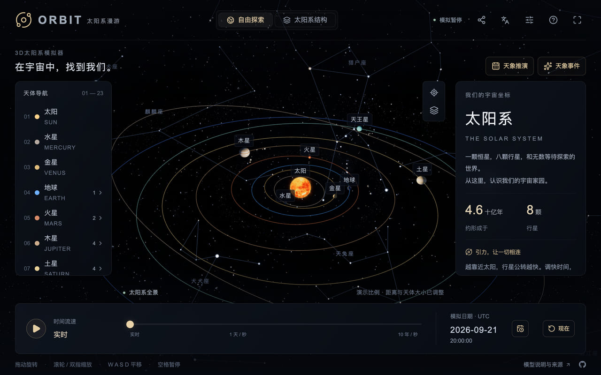
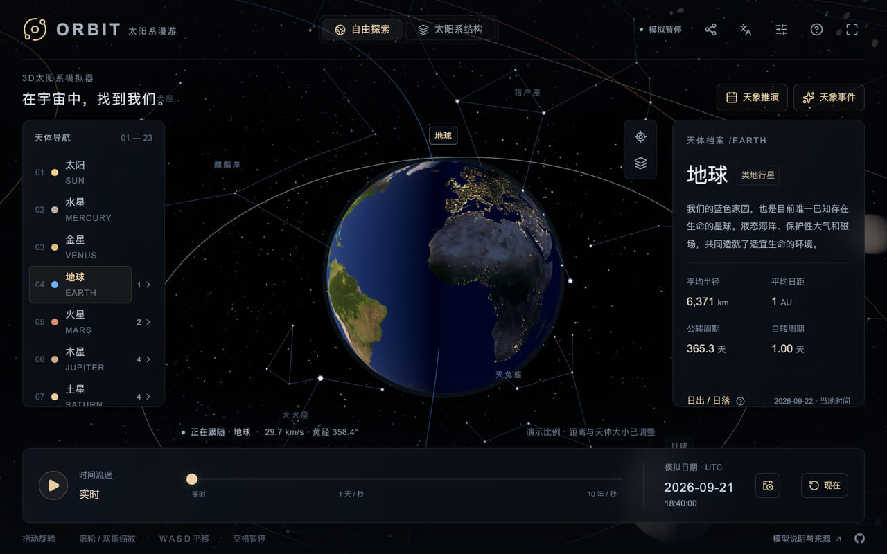
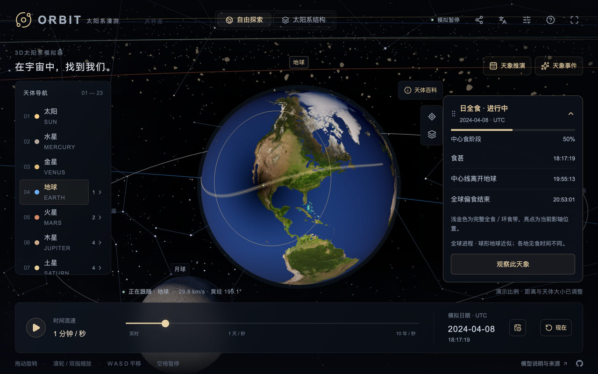
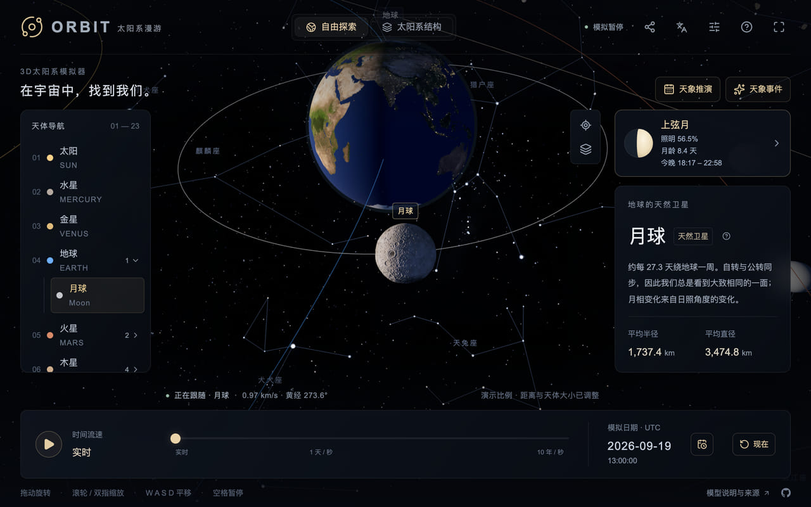
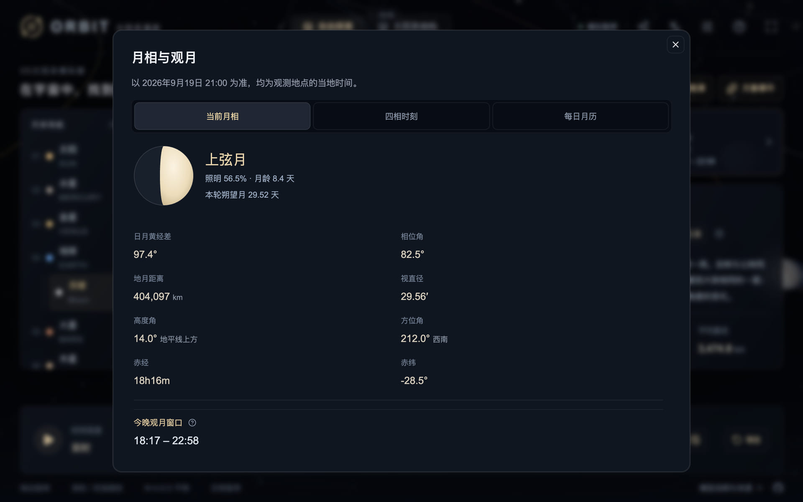
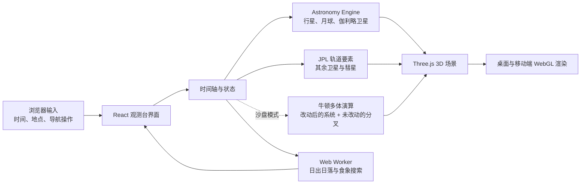

<div align="center">
  

# ORBIT · 太阳系漫游

**面向学习的交互式 3D 太阳系观测台**

**[English](README.md) · [简体中文](README.zh-CN.md)**

[在线体验](https://orbits.observer/) · [提交问题](https://github.com/hugogu/orbit/issues) · [功能建议](https://github.com/hugogu/orbit/issues/new)

</div>

> 上图为项目视觉封面，不是应用界面截图。ORBIT 在浏览器中运行，无需安装客户端。

ORBIT 将可交互的 3D 场景、可调时间轴和可说明来源的天文计算结合在一起。它适合用来观察太阳系中天体的相对运动、认识主要卫星和彗星，并从指定观测地点了解日出、日落与食象。

## 功能一览

|     | 能做什么                                                             | 适合了解什么                                     |
| --- | -------------------------------------------------------------------- | ------------------------------------------------ |
| ☀️  | 以当前时刻或 **1700–2200 年**的任意 UTC 时刻运行场景                 | 行星位置、公转、自转与时间尺度                   |
| 🪐  | 浏览太阳、八大行星、冥王星、19 颗代表性卫星、4 颗著名彗星与土星环    | 天体类型、轨道和物理特征                         |
| 🔭  | 选中、跟随、俯视或一键返回全景；导航栏可展开卫星并直接定位           | 从太阳系全局切换到单个天体                       |
| 🌅  | 输入经纬度与固定 UTC 偏移，或使用浏览器当前位置                      | 当地某一天的日出、日落、昼长                     |
| 🌑  | 查询下一次日食、月食与下一次当地可见的日食                           | 食象发生时刻、最大食分附近的几何关系             |
| 🌒  | 选中月球后出现月相卡片，可展开未来 12 次四相时刻、整月每日数据与今晚观月窗口 | 月龄、照明、地月距离、视直径、月出中天月落，以及几点看 |
| 🌗  | 显示天体昼夜分界、地球夜间灯光，以及日食时的本影、半影与影轴轨迹     | 日照、月食和日食的空间几何                       |
| 🧪  | 进入沙盘模式，把当前时刻分叉成牛顿多体演算：修改任意天体的质量、轨道速度与日距，增删天体，并让新路径与原始路径在同一时刻并排对比 | 是什么维系着一个太阳系，又需要多少改动才能让它瓦解 |
| ✨  | 在自动、标准 2K 与最高 8K 纹理之间选择；银河背景可单独开关           | 视觉质量与设备性能之间的取舍                     |
| 🌌  | 可开启真实星空：9,096 颗肉眼可见恒星按自行推算到模拟年份就位，附 88 星座连线，银河全景对齐到同一片天区 | 行星背后就是它们实际所处的星空                   |
| 🗺️  | 可选：仅在跟随水星、金星、地球或火星时加载 2K 真实地形光照           | 公开地形数据增强近距离明暗起伏，但不改变球体网格 |
| 📱  | 支持桌面鼠标和键盘、触屏手势、手机横屏与竖屏布局                     | 不同设备上的连续探索                             |
| 🌐  | 支持简体中文、英语、日语，自动识别浏览器语言并记住手动选择           | 天体介绍、知识卡片、场景标签与天象工具完整翻译   |
| 📚  | 阅读天象事件指南：流星雨、合相、冲、大距、月相与日月食                | 常见天象的成因、周期与观测要点                   |
| 🔗  | 分享此刻所见：链接可复现同一时刻、同一天体与同一取景，并附带当前画面 | 把你正在看到的景象原样分享给别人                 |

## 在真实运行中观察

<table>
  <tr>
    <td width="50%" align="center"><br /><sub>打开即见的全景：行星运行在它们真实所处的星座之间</sub></td>
    <td width="50%" align="center"><br /><sub>地球夜半球：城市灯光会随太阳方向自然显现</sub></td>
  </tr>
  <tr>
    <td width="50%" align="center"><br /><sub>2024 年 4 月 8 日日全食：食影边界、影轴轨迹与实时进度卡片</sub></td>
    <td width="50%" align="center"><br /><sub>选中月球后，资料面板旁出现月相卡片，直接给出今晚的观月窗口</sub></td>
  </tr>
</table>

四张图片均从本项目实际运行的观测台截取。项目提供高分辨率日间与夜间纹理；会按设置、设备类型、节省流量偏好和 GPU 纹理限制选择加载质量。高分辨率材质只在需要时为当前跟随天体加载，并会在替换后释放上一份资源。

行星基础形状按观测扁率构建，并保持资料中的体积平均半径。“观测设置 → 材质”提供独立的“真实地形光照”和“真实地形几何”开关：两者采用统一经纬度的公开高程数据，起伏做 6 倍视觉增强。光照选项使用 2K 物体空间法线；几何选项重建当前跟随行星的 256×128 网格，并同步更新法线、包围范围和鼠标拾取。支持水星、金星、地球、火星；地球海平面以下按海面展示，金星显示去云地形及示意底色。两者均不计算山体投影，巨行星保留大气外观。详见[数据来源与生成方法](public/textures/planets/CREDITS.md)。

彗星现在使用各自独立的彗核网格。哈雷彗星使用 Phil Stooke/NASA PDS 模型，67P 使用 ESA/Rosetta 的低分辨率笛卡尔三角片模型；只在选中时加载，并在加载后保留缓存。恩克和海尔–波普目前没有随仓库发布的完整全球彗核模型，因此使用明确标注的观测尺寸约束近似，不冒充实测地形。彗核反照率、彗发和彗尾仍为示意。详见[彗星形状模型署名](public/models/comets/CREDITS.md)。

### 行星背后的那片真实星空

背景不再只是装饰。场景中的 9,096 颗肉眼可见恒星来自《耶鲁亮星星表》，按 J2000 赤道坐标定位，亮度与颜色取自实测星等与 B−V 色指数，并按各自的自行推算到当前模拟年份——把时间拨远，动的不只是行星，还有近距离的高自行恒星。其上是国际天文学联合会 88 星座的传统连线，公开数据中的每个折点都吸附到最近的目录恒星，连线不会停在没有星的空处。星座名称写在它所命名的那片星群之中，而非星图印刷的标注位置：落在图形自身高度约十分之四处、横向居中，并使用读者当前的语言。银河全景经银道坐标转入同一 J2000 参考系，因此它的带状结构与前方恒星彼此吻合。整片星空始终以相机为中心，表现为一片无法靠近的无穷远天幕。

“观测设置 → 环境”下有三个独立开关——**银河背景**、**真实星空**、**星座连线**，其中星座连线依赖真实星空。星座名称随“图层 → 天体名称”一同显示。

### 逐夜观月

选中月球后，资料面板旁出现月相卡片，只放不必展开就值得一看的内容：绘制的月相圆面、月相名称、照明比例与月龄，以及今晚何时可见。南半球观测点的圆面会左右翻转。日月食进行中时，同一角落让位给天象进度卡片——那时它才是有话要说的一方。

<p align="center"></p>
<p align="center"><sub>月相卡片展开后的面板：锚定在观测地当地时间，模拟时钟仍在其后继续走</sub></p>

展开卡片得到完整面板，分三个标签页。**当前月相**补上距角、相位角、地月距离、视直径、地平高度与方位角、赤经与赤纬，以及今晚观月窗口——即从日落到次日日出的这一夜里，月亮真正位于地平线以上的那一段。**四相时刻**列出此后 12 次朔望四相：新月、上弦、满月、下弦。**每日月历**给出整月逐日数据——月相、月龄、照明、月出、中天、月落、中天高度、距离与视直径——并在四相所在那天标出精确时刻。所有数值都使用与日出日落、日月食工具相同的观测点坐标与固定 UTC 偏移。

## 地表观星

沙盘运行中也可以进入地表观星，已运行时间、流速和暂停状态都会保留；点击「返回总览」可继续调整同一个沙盘。天空使用模拟地球的位置和半径，以及仍然存在的天体的当前位置和大小，也包括自行添加的天体。地平线跟随地球设置的轴倾角和实际自转，修改周期时自转相位连续。这里按模拟时间计算自转，不使用轨道视图为方便观看而放慢的转速，因此高流速可能超过屏幕刷新率。地球被移除或吞并后会自动返回总览。沙盘使用位于地月质心的球形地球，不含月球和光行时修正，展示的是牛顿力学实验的天空。

在沙盘之外，点击“总览”“俯视”旁的望远镜按钮，站到共用的地球观测点，并从当前时刻实时观察。没有手动指定地点时会请求设备定位；地平线、东南西北、太阳、月球、行星和星空随地点及模拟时间计算。观测地点与日出日落、食象工具共用，可在观星面板中定位或修改。

手机允许朝向权限后，背面朝向哪片天空，画面就跟到哪里。支持横竖屏姿态转换；Safari 的磁北读数通过 [geomagnetism 的 WMM2025 模型](https://github.com/naturalatlas/geomagnetism)（Apache-2.0）按设备实际日期校正为真北，并提供方位微调。需要 HTTPS；权限被拒绝或没有可靠指南针时，可拖动或在场景获得焦点后使用方向键，滚轮/双指调整视野。实际对齐精度仍受手机传感器和周围磁场影响。

“真实大小”显示实际视角直径；演示模式将太阳、月球放大 10 倍，并为行星保留可见的最小尺寸。“真实距离”保留观测者到天体的距离比例，关闭则压缩深度；四种组合都保持中心方位准确，单独改变距离不会改变视角大小。地平线遮挡下半球。为教学保留白天的星空显示，不模拟天气、光污染、大气折射和当地地形。观星模式不生成分享链接，因为分享链接按设计不携带观测地点。

## 交互方式

导航中新增独立折叠的**小行星**与**彗星**分组。谷神星（矮行星）、智神星、婚神星、灶神星、灵神星、爱神星、丝川、贝努和龙宫均可在场景内定位，也有三语独立资料页、物理数据与带署名的分享图。为保持全景清晰，仅显示当前选中小行星的标签与轨道。

小行星轨道和物理参数来自 2026-09-13 获取的 [NASA/JPL SBDB](https://ssd.jpl.nasa.gov/tools/sbdb_lookup.html) 离线快照。带历元二体近似未计入行星摄动与热辐射效应，不用于交会或撞击预测；真实大小与距离设置同样适用于小行星。场景使用来自任务、PDS、Dawn、隼鸟/隼鸟二号、OSIRIS-REx、VLT/SPHERE 和 DAMIT 的独立形状数据；谷神星保留观测到的近球形，并使用 Dawn 贴图与地形法线。智神星使用 Carry 等公开、覆盖约 80% 表面的 K 波段相对反照率图，并采样到匹配的 DAMIT 形状模型上；灵神星使用与 DAMIT 1806 形状模型逐面对应的相对反照率数据。婚神星没有可下载的全球反照率图，因此保留自己的 JPL 几何反照率与光谱类别驱动的材质，不混用通用贴图。详见[形状数据署名](public/models/asteroids/CREDITS.md)与[表面贴图署名](public/textures/asteroids/CREDITS.md)。小行星不参与食影计算。

| 场景导航                                                                    | 时间控制                                   | 天文计算                              |
| --------------------------------------------------------------------------- | ------------------------------------------ | ------------------------------------- |
| 鼠标左键拖动旋转、滚轮缩放、右键拖动平移                                    | 9 档速度、暂停、回到“现在”、指定日期       | 日出日落、全球日食/月食、当地可见日食 |
| 单指旋转、双指缩放、双指平移                                                | 模拟时钟在切换天体后仍保持                 | 在食象最大时刻聚焦地球或月球          |
| `WASD` / 方向键平移，`+` / `-` 缩放，`Space` 暂停，`R` 全景，`Esc` 结束跟随 | 从实时到十年/秒，含适合观察食象的一分钟/秒 | 观测点支持手动输入与浏览器定位        |

顶栏的**分享此刻所见**会截取当前画面，并生成一条指回它的链接。链接复现同一模拟时刻、播放状态、跟随天体，以及相机的角度与远近——远近按该天体自身取景距离的比例记录，因此在对方的大小与距离设置下，天体的视觉大小保持一致。共享取景会一直保持，直到对方自己转动相机。链接会保留在地址栏中，可刷新、收藏或再次转发；切换到别的天体后即清除。其中不含观测坐标和显示偏好，因此不会覆盖对方自己的设置。若目标应用接受图片——手机系统分享面板，或任何平台上的**保存图片**——截图会随链接一起发出，并带有天体名称、UTC 时刻，以及可扫码回到同一视角的二维码，因此仅凭这张图片就足够。其余场合，链接的社交卡片回退为同一天体的渲染图。在桌面端，分享面板还会按屏幕自身分辨率绘制同一链接的二维码，便于把当前视角带到手机上继续观测。

可在观测设置中开关太阳活动效果。日冕细丝、日珥和黑子共享 UTC 模拟时钟：暂停即冻结，跳回同一日期可复现相同状态。建议用 **1 天/秒** 观察生长、消散和自转。生命周期采用数天到数月的示意范围，并体现随纬度变化的自转速度；生成的活动区不代表历史实测或未来预测。参考 [NASA 日珥](https://www.nasa.gov/image-article/what-solar-prominence/)、[NASA 黑子](https://science.nasa.gov/sun/sunspots/)和 [NASA 差异自转](https://www.nasa.gov/image-article/solar-rotation-varies-by-latitude/)。

## 场景与数据流



### 可探索的天体

- **行星系统**：太阳、八大行星、冥王星、土星环，以及小行星带、柯伊伯带、散布盘、日球层和示意性的奥尔特云。
- **外围结构的真实尺度**：开启真实相对距离后，小行星带、柯伊伯带、离散盘与日球顶会移到各自资料卡所标注的日心距离。奥尔特云最近也在约 2,000 AU，因此仅在示意比例下显示，不会出现在海王星外侧。
- **小行星带**：1,800 块小型示意岩体复用六种不规则形状，具有不同大小、朝向和哑光颜色。GPU 动画与模拟时钟同步，支持暂停和日期跳转：公转遵循开普勒第三定律，内侧快、外侧慢；示意自转周期在 2 至 12 小时之间变化。实例化将绘制调用控制在六次，无需逐帧上传实例数据；远景每块 20 个三角面，近景提升至 80 个。位置与大小经过艺术化处理，不代表实测目录或真实空间密度。
- **卫星目录**：19 颗可独立查看的代表性卫星，包含月球、伽利略卫星和卡戎；每颗都有独立介绍页、基础物理数据、轨道数据、来源链接和随机趣味知识。
- **彗星导航**：哈雷彗星、恩克彗星、67P/丘留莫夫–格拉西缅科彗星、海尔–波普彗星。可沿时间轴观察其模型轨道，也可跳到模型中的下一次近日点。
- **知识卡片**：33 个可选天体各有 30 条带来源的“你知道吗”内容；每次打开页面会轮换，避免总是看到同一条。

## 快速开始

### 前置条件

- [Node.js](https://nodejs.org/) `^22.13.0 || ^24.0.0`（22 与 24 两条 LTS 线）
- npm（项目包含 `package-lock.json`）
- 支持 WebGL 的现代浏览器；推荐开启硬件加速

### 本地运行

```bash
git clone git@github.com:hugogu/orbit.git
cd orbit
npm ci
npm run dev
```

随后打开终端输出的本地地址。开发时，浏览器定位功能只会在安全上下文（HTTPS 或 localhost）下请求权限。

### 质量检查

```bash
npm test
npm run lint
npx tsc --noEmit
npm run build
```

测试涵盖 UTC 时钟、天体坐标转换、地球昼夜方向、卫星与彗星轨道、食象峰值、地点边界、纹理策略与交互状态。提交前请运行以上检查；涉及 Vercel 发布时，另外运行：

```bash
npm run build:vercel
```

## 部署

ORBIT 以静态导出方式部署到 Vercel，另有独立的 Cloudflare Worker 构建目标用于 Sites 平台；Google Analytics 为可选功能，通过一个环境变量控制。Vercel 项目配置、构建参数与分析配置请参阅[部署指南](docs/deployment.md)。

Vercel 构建还会输出可抓取的天体资料页（`/:locale/bodies/:id`，汇总于 `/:locale/bodies`）、天象事件指南（`/:locale/events` 与 `/:locale/events/:id`）、`robots.txt` 和 `sitemap.xml`。在 Vercel 项目中部署前，请将 `NEXT_PUBLIC_SITE_URL` 设置为正式的 HTTPS 域名；构建会用它生成 canonical、Open Graph、多语言 alternate 与 sitemap 地址。未设置时使用演示域名。

### 安装与离线使用

打开 HTTPS 站点后，使用浏览器的**安装应用**功能；iPhone/iPad 可在 Safari 中选择**分享 → 添加到主屏幕**。安装后的 ORBIT 使用独立窗口，并保留语言和显示偏好。

首次联网访问并完成缓存（约 9 MiB）后，模拟器、行星基础纹理和天文计算可离线使用。已访问的详情页、额外纹理和模型会按需缓存，并受容量限制；未加载过的素材仍需联网。浏览器清理存储后需重新联网缓存。新版本会在关闭所有 ORBIT 窗口及标签页、重新打开后生效。构建与验证说明见 [PWA 部署文档](docs/deployment.md#progressive-web-app-pwa)。

## 模型边界与准确性

ORBIT 用于天文学习，并在界面中说明模型的假设与适用范围，不适用于导航或专业星历计算。显示和查询共享一个 UTC 时钟，但各部分有不同的精度范围：

| 范围                           | 实现方式                                                                                             | 使用时应了解                                           |
| ------------------------------ | ---------------------------------------------------------------------------------------------------- | ------------------------------------------------------ |
| 行星、冥王星、月球、伽利略卫星 | [Astronomy Engine](https://github.com/cosinekitty/astronomy) 的位置计算，转为固定 J2000 黄道场景坐标 | 用于教育观察；表面贴图经纬度并非测绘保证               |
| 其余代表性卫星                 | JPL 固定历元平均轨道要素                                                                             | 未包含摄动、共振和长期岁差，远离历元的相位误差可能较大 |
| 四颗彗星                       | JPL Small-Body Database 快照的两体传播；各自独立的实测或观测约束彗核网格                             | 未包含引力摄动和释气；近日点与回归日期不能视为精确预报 |
| 日出、日落与食象               | 独立 Web Worker 搜索；日出日落采用给定固定 UTC 偏移、太阳上缘和标准大气折射                          | 未计入地形、天气与动态夏令时；全球食象不等于当地可见   |
| 阴影                           | 物理半径与日心向量计算本影、半影和反本影，再映射到展示网格                                           | 不包含大气折射、太阳边缘变暗、地形、行星环或彗星的影响 |

### 比例设置

默认的演示模式会压缩距离并放大天体，便于在同一画面中观察。**观测设置 → 布局** 将真实大小与真实距离两个开关集中在一起。调整立即生效并保存在当前浏览器中。两个真实比例均开启时，太阳、行星与 19 颗卫星使用同一物理比例；彗核形状使用实测网格或明确标注的近似，表面、彗尾和辉光仍保持教学用示意效果。同一标签页还提供操作按钮文字开关：关闭后，天象推演、天象事件与天体百科按钮只保留图标，把画面让给场景；按钮名称仍保留在悬停提示与读屏软件中。显示调整不影响模拟日期、运行周期和天象计算。

## 技术栈

| 类别       | 采用技术                                                 |
| ---------- | -------------------------------------------------------- |
| 界面       | React 19、TypeScript、Vinext                             |
| 3D 渲染    | Three.js、WebGL                                          |
| 星历与事件 | Astronomy Engine、JPL 数据与浏览器 Web Worker            |
| 样式与交互 | Tailwind CSS、Base UI、Lucide                            |
| 数据统计   | Google Analytics 4（`next/script`，环境变量控制）        |
| 部署       | Vercel 静态导出；也保留 Sites/Cloudflare Worker 构建目标 |

## 贡献

改进翻译或添加更多语言，请参阅[多语言扩展指南](docs/i18n.md)。新语言只需增加独立词库并注册；切换语言会保留当前天体、相机视角与模拟时间。

欢迎提交改进。开始前请先查看现有 [Issues](https://github.com/hugogu/orbit/issues)，避免重复工作。

1. Fork 本仓库并从默认分支新建一个聚焦的分支。
2. 保持改动小而完整；功能、重构和构建配置尽量拆成独立提交。
3. 为行为变更补充或更新测试，并运行“质量检查”中的全部命令。
4. 提交 Pull Request 时说明用户可见的变化、数据来源或模型假设的变更，以及验证方式。

报告问题时，请附上浏览器与版本、设备类型、屏幕尺寸、发生时间、所在地时区/坐标（如与地点计算相关）和复现步骤。请勿提交密钥、精确家庭地址或其他敏感信息。

## 数据与素材致谢

- [NASA Solar System](https://science.nasa.gov/solar-system/planets/)、[NASA Kuiper Belt](https://science.nasa.gov/solar-system/kuiper-belt/facts/)、[NASA Oort Cloud](https://science.nasa.gov/solar-system/oort-cloud/facts/)
- [JPL 行星物理参数](https://ssd.jpl.nasa.gov/planets/phys_par.html)、[JPL 近似位置/开普勒要素](https://ssd.jpl.nasa.gov/planets/approx_pos.html)、[JPL 卫星数据](https://ssd.jpl.nasa.gov/sats/)
- [JPL Small-Body Database](https://ssd.jpl.nasa.gov/tools/sbdb_lookup.html)
- [NASA 日食几何](https://eclipse.gsfc.nasa.gov/SEhelp/SEgeometry.html)
- [Astronomy Engine](https://github.com/cosinekitty/astronomy)（MIT）
- 行星纹理主要来自 [Solar System Scope Textures](https://www.solarsystemscope.com/textures/)，按 [CC BY 4.0](https://creativecommons.org/licenses/by/4.0/) 使用。实际文件尺寸、下载来源与许可记录在 [`public/textures/source-manifest.json`](public/textures/source-manifest.json)。部分纹理使用增强色彩或示意性地形。银河全景是实拍照片：它按银道坐标转入场景所用的 J2000 参考系，因此银河带与星表恒星互相吻合，地表模式再将观测者的地平坐标转换到同一参考系。
- 可选的行星真实表面细节来自公开 NASA/USGS 地形数据，经固定版本的 CelestiaContent 法线贴图处理并下采样；详见 [`public/textures/planets/CREDITS.md`](public/textures/planets/CREDITS.md)。这些 2K 贴图只提供光照起伏，不进行几何位移；气态巨行星没有固体表面，仍使用大气表现。
- 卫星贴图来自 [CelestiaContent](https://github.com/CelestiaProject/CelestiaContent)，各文件采用的 CC BY 或 CC BY-SA 条款记录在 [`public/textures/satellites/CREDITS.md`](public/textures/satellites/CREDITS.md)。天卫一、天卫五、天卫二、天卫三、天卫四和海卫一的 Voyager 贴图存在未测绘区域；本地副本用邻近的已观测纹理镜像填补缺口，避免近距离观察时出现单色半球。由于缺少完整全球反照率地图，海卫二、冥王星和冥卫一使用 CC BY 4.0 的 `asteroid.jpg` 作为明确标注的科普示意材质。彗星的形状模型来源和表面数据限制记录在 [`public/models/comets/CREDITS.md`](public/models/comets/CREDITS.md)。
- 小行星贴图与转换后的形状资产分别记录在 [`public/textures/asteroids/CREDITS.md`](public/textures/asteroids/CREDITS.md) 和 [`public/models/asteroids/CREDITS.md`](public/models/asteroids/CREDITS.md)；命名小行星目录不再使用通用 `asteroid.jpg`。
- 恒星数据来自[《耶鲁亮星星表》第 5 修订版](https://cdsarc.cds.unistra.fr/ftp/V/50/)（Hoffleit & Warren, 1991），以紧凑二进制随项目分发，含 J2000 位置、自行、星等与 B−V 色指数。星座连线来自 [d3-celestial](https://github.com/ofrohn/d3-celestial)（BSD-3-Clause），每个折线顶点都吸附到最近的星表恒星。星座名写在所属恒星之间：取图形自身高度自上而下四成处、水平居中，而不是沿用平面星图印在图形之外的标注点。来源与许可记录在 [`public/sky/source-manifest.json`](public/sky/source-manifest.json)，`npm run generate:sky` 可重新生成这两份资源。
- 天王星使用 Solar System Scope 的 CC BY 4.0 大气示意图。原先禁止商业使用的天王星与冥卫一文件，以及再分发条款不明确的 NASA/JPL 冥王星示意图，已不再使用或随项目分发。

## 许可证

本仓库中的源代码采用 [PolyForm Noncommercial License 1.0.0](LICENSE) 授权。该许可证允许个人、教育、研究、兴趣项目及其他非商业用途，包括在本地部署和进行非商业修改，但必须遵守许可证条款；它不授予商业托管、SaaS、付费分发或商业产品使用权。

商业使用需要另行签署书面协议，详见[商业授权说明](COMMERCIAL-LICENSE.md)。项目名称、标志和官方分发规则见[商标与官方分发政策](TRADEMARKS.md)。

第三方代码、数据和纹理仍适用各自的许可证。具体素材条款请查看[卫星纹理致谢](public/textures/satellites/CREDITS.md)和[纹理来源清单](public/textures/source-manifest.json)。
